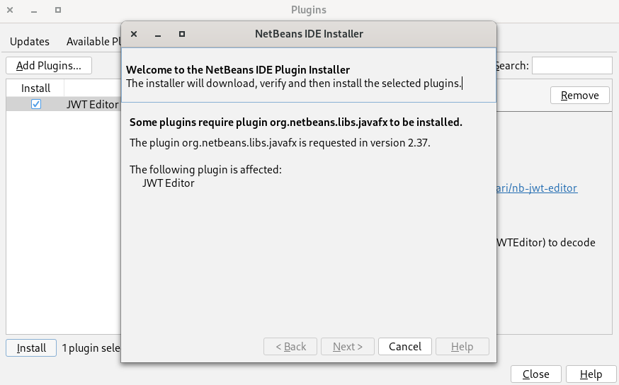
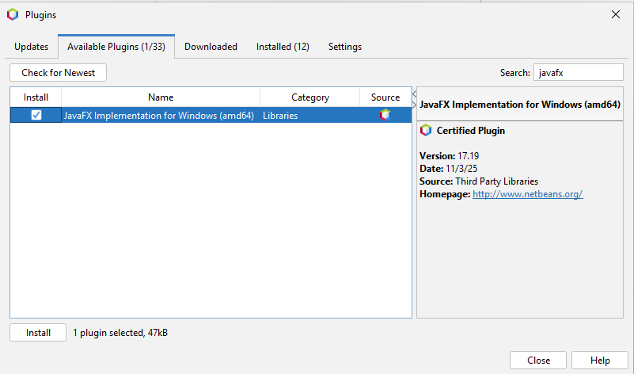

#  NetBeans JWT Editor

A NetBeans IDE plugin for viewing and verifying JWT (JSON Web Token) tokens with real-time decoding and signature verification.

Built with JavaFX to provide a modern and responsive user interface within the NetBeans ecosystem.

## Features

- **Real-time JWT Decoding**: Automatically decodes JWT tokens as you paste or type them.
- **Header and Payload Viewer**: Displays decoded headers and payload claims in an organized tree-table.
- **Signature Verification**: Verify JWT signatures using a provided secret key (HMAC256).
- **Visual Feedback**: Immediate v  isual cues for valid tokens and signature status.

## Installation

### Requirements

- **NetBeans IDE**: Version 28 or later is recommended.
- **Java**: JDK 21 or later.
- **JavaFX**: The plugin bundles the required JavaFX libraries, but ensure your
  JDK/JRE supports JavaFX or that NetBeans is configured to run on a JDK that
  includes it or install the NetBeans module **JavaFX Implementation** for your
  platform.

### NetBans Portal Installation

1. Go to  **Tools** &rarr; **Plugins**.
2. **Available Plugins**:
   - type ```jwt``` in the Search box
   - Select **JWT Editor**
   - Click **Install** and follow the wizard.



Note that NetBeans does not allow to intall the plgin if JavaFX is not available.
If you run in the message below, see teh section **JavaFX Installation**.


### Step-by-Step Installation

1. **Download the NBM**: Obtain the latest `.nbm` file from the [releases](https://github.com/stefanofornari/nb-jwt-editor/releases) page.
2. **Open NetBeans**: Launch your NetBeans IDE.
3. **Plugins Manager**: Go to **Tools** &rarr; **Plugins**.
4. **Manual Install**:
   - Click the **Downloaded** tab.
   - Click **Add Plugins...**.
   - Select the downloaded `.nbm` file.
   - Click **Install** and follow the wizard.

### Building from Source

If you wish to build the plugin yourself:

```bash
git clone https://github.com/stefanofornari/nb-jwt-editor.git
cd nb-jwt-editor
mvn clean package
```

The resulting `.nbm` file will be in the `target` directory.

## Usage

Once installed, you can access the JWT Editor:

1. Go to **Windows** &rarr; **IDE Tools** &rarr; **JWT Editor**.
2. The JWT Editor panel will open (typically at the bottom).
3. Paste your encoded JWT into the **Encoded Token** area.
4. The **Header** and **Payload** sections will update instantly.
5. To verify a signature, enter the secret in the **JWT Signature Verification** field.

## JavaFX Installation
JWT Edito requires JavaFX to be available in NetBeans. If you use a JDK that bundles
JavaFX, you are all set: JavaFX will be available and you can install the plugin.

If not, you will see the message mentioned above. In such case you have two choices:

1. Install and run NetBeans with a JDK that bundles JavaFX. Well knonw JDKs with
   JavaFX are:
   - [Azul JDK](https://www.azul.com/downloads)
   - [Liberica JDK by bellsoft](https://bell-sw.com/pages/downloads)
2. Activate the JavaFX Implementation for Windows/Linux/Macos directly in the
   plugin manager; after that, you can install **JWT Editor** with the above instructions.



---
**License**: Apache 2.0
**Author**: Stefano Fornari
